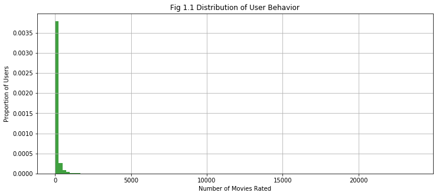
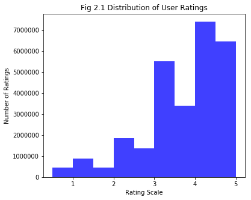
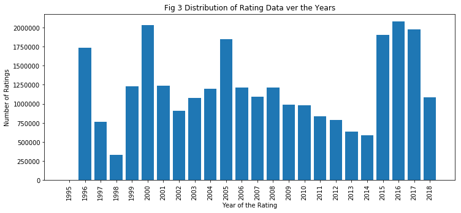

# Final project : Recommending the next best movie

**Course:** E4571 Personalisation Theory, Fall 2018, Columbia University

**Instructor:** Prof. Brett Vintch

**Team Members:** Ashwin Jayaraman, Somendra Tripathi, Akhil Punia

## About the Movie Lens Data Set

Full: 27,000,000 ratings and 1,100,000 tag applications applied to 58,000 movies by 280,000 users. Includes tag genome data with 14 million relevance scores across 1,100 tags. Last updated 9/2018. [Link](http://grouplens.org/datasets/movielens/latest/)

> **Observations:**
- Of the 2,83,228 users using Movies around 69,000 people rated more then 100 movies and 45,912 users have rated less than 10 movies.
- We would want to remove those users who have rated the movies highly from the catalogue as it maybe from a bot account or professional reviewer. Since, we are trying to model the interrests of the larger public it would make sense to take the data of users who haven't rated more than 100 movies.
- Also new users who have rated less than 10 movies, present the classical cold start problem. We should not use them in building our recommender simply because enough data is not available.

> **Observations:**
- We see that the average rating is centred around the 3.5 and the interquartile range is between 3-4. A lot of movies have been highly rated.

> **Observations:**
- In this particular sample of dataset provided from Movielens, we see a sudden resurgence in the number of available ratings beginning from the year 2015.

> **Observations:**
- The Popularity of Movies follow the long tail distibution which exemplifies the pgenomenon of rich gets richer. More Popular movies get more ratings.

> **Observations:**
- Majority of the Users use the platform for rating for only single year. It is expected as it is an academic dataset and not a commercial product which monitors its users over the years.
- This provides an interesting challenge in which the older movies will tend to be the most rated as new movies only have a fraction of overall users to receive ratings from.

Code for EDA is available [here](eda.ipynb).

## Business Problem

For the purposes of this project, we regard ourselves as a movie recommendation and review website which prides itself with quality recommendations that it is able to generate for its registered users.

Our business model is built around selling our customers digital content (like iTunes) and recommending them to subscription services where they can watch their favorite movies. Another part of our job is to engage users on our platform, so that they actively use it to review new movies. It is extremely important to us as it will ensure that we continuously build a growing repository of data that is both rich ( both in quality and quantity ) and relevant with changing time.
Two way we supply these recommendations:
- Display top recommeded movies on our website dashboard.
- Sending out emails to registered users with relevant recommednations to keep them engaged with our platform.
### TLDR
**Maximize:** Online Purchases and Website Engagement

**Avoid:** Becoming a Spammer. Focus on Quality Recommendations.

The objective then is to identify what number of active users on platforms should be targeted and with what frequency.
In easy terms, this task can be be simply understood as making Top 5 recommendations to a carefully selected subset of registered users.

### Challenges
#### **Sparsity**
As we observe from the above exploratory analysis, we see that there are a lot of users and movies. Most users have not seen many of the movies making the item ratings matrix extremely sparse. We first create a subset of users who have seen at least a certain number of movies. This is useful for training the different types of models. Handling those users who have not seen a certain number of movies is discussed under the cold start section. 

#### **Outliers**
Certain users have seen and rated a lot of movies. We believe that these users might be bots and should be removed from the data. This was done to make our models more realistic and adapt to the real world. This is highlighted by the fact that the top 9863 users contribute to ratings for 9153392 movies. These users roughly rate 928.05 movies. 
 
#### **Model Explainability and User Trust**
Our business requirement is that we would want to engage our users. We believe explaining why a particular movie is recommended to the user would increase the engagement with the user and would increase the likelihood of the user watching the movie. 

Using approximate nearest neighbours and Factorization Machines, we can explain the reason why a particular movie is being watched. Approximate nearest neighbours provides the similar users and we can recommend using the tagline "Users like you watched this".

Factorization Machines gives us the importance of the coefficiants and we can explain why a particular movie is being recommended based on those values .

#### **Serendipity**
We have created different types of models in Factorization Machines. The weight for these movies allows us to recommed certain type of novelties.

#### **Cold Start Problem**
New users would be asked to provide us a choice of certain movies that they like. Based on those movies, we would autoencode those movies and find similar movies near that cohort. Once we have learnt a bit about the user, we can then use Factorization Machines and Nearest Neighbours to generate predictions

For new movies, through our autoencoders, we would be able to determine similar movies and also the users who have watched those movies. Based on that, we would start recommending the movies. Once enough users have seen the movie, we can use the other 2 models as well to determine the recommendations.

## Models
- [Approximate Nearest Neighbors (ANN) using Locality Sensitive Hashing (LSH)](ANN.md)
- [Factorization Machines using ALS on user-item features](Fast_FM.md)
- [Deep Learning Approaches: Learning Embeddings through Shallow Networks](DeepLearning.md)

Each of the above 3 models are used for certain purposes. Embeddings will be used to recommed to new users for whom we do not have enough data. Once the user reaches the threshold after which we are confident, we would show the users recommendations from all 3 models. Depending on the feedback we recieve, we can assign weights to the 3 models. Due to the weights, the number of movies recommeded by a particular model would be more as compared with the other models.

Each week, we hope to retrain these models to update for the newly generated data. The frequency will be decided upon by the business owners but we feel training wekkly should be useful for now. 
